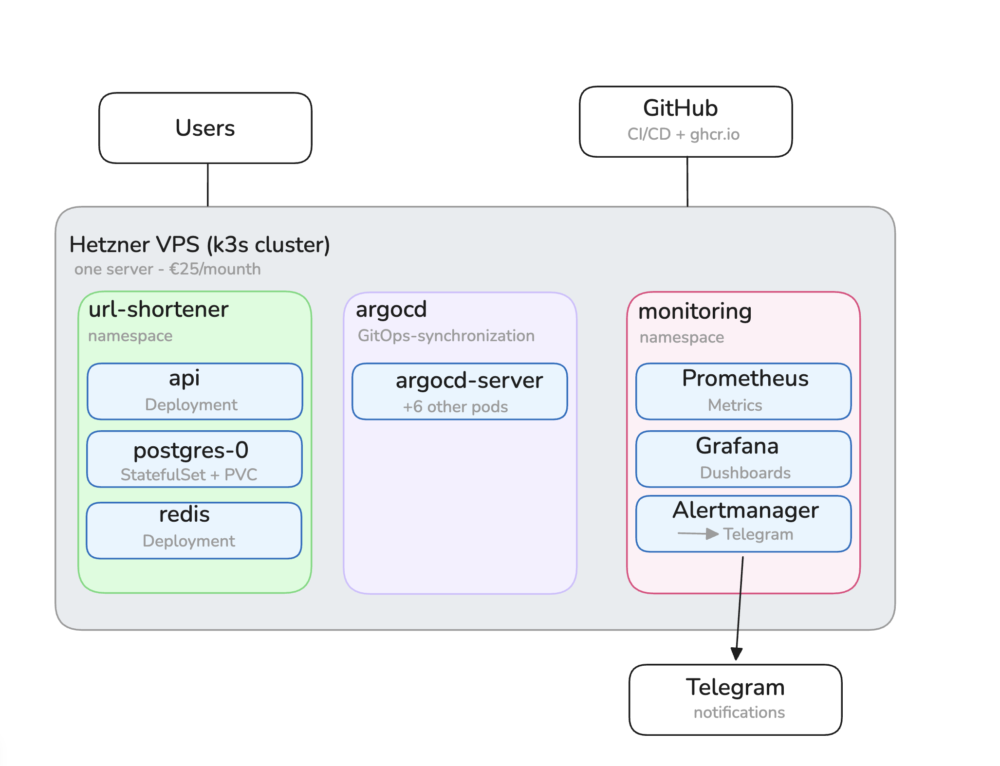
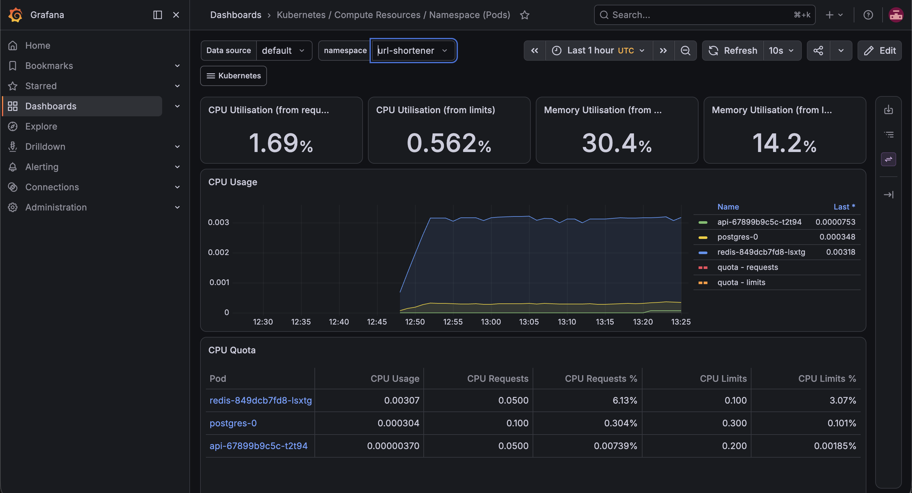
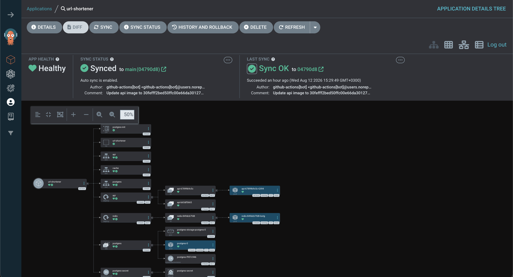
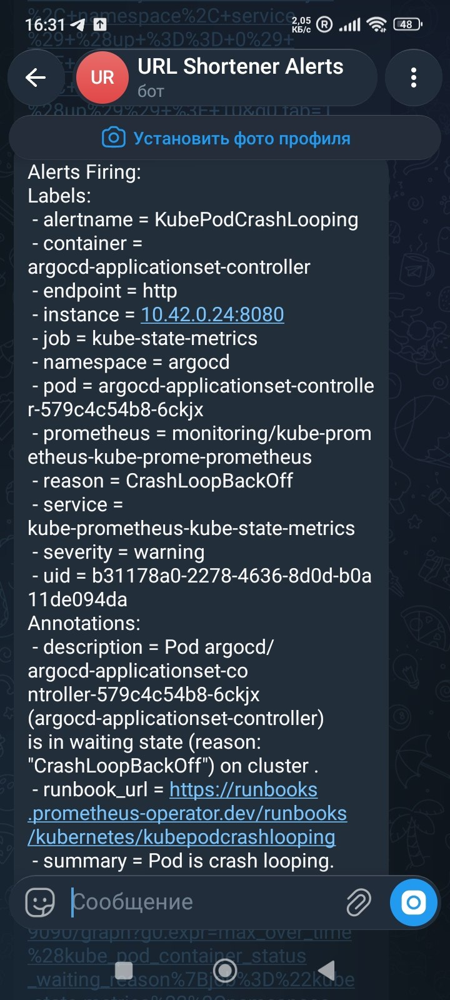
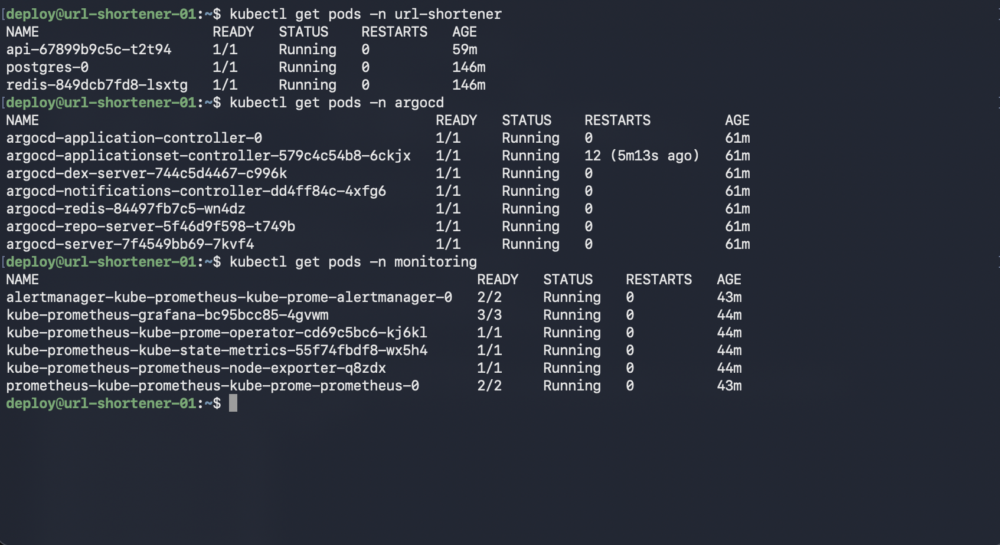

# URL Shortener

A URL shortening service built end-to-end with infrastructure as code, GitOps, monitoring, and alerting on real infrastructure.

## Stack

| Layer | Technology |
|---|---|
| Infrastructure | Terraform (Hetzner Cloud) |
| Server configuration | Ansible |
| Orchestration | Kubernetes (k3s) |
| Containerization | Docker |
| CI/CD | GitHub Actions + GitOps |
| Deployment | ArgoCD |
| Monitoring | Prometheus + Grafana |
| Alerting | Alertmanager → Telegram |
| Secrets | Sealed Secrets |
| Application | Node.js/Express, PostgreSQL, Redis |

## Architecture

One Hetzner server (k3s cluster), split into three namespaces:
- `url-shortener` - the application itself (api, postgres as a StatefulSet with a PVC, redis)
- `argocd` - the GitOps controller that syncs the cluster with this repository
- `monitoring` - Prometheus, Grafana, Alertmanager



## How to deploy this

The full, verified sequence lives in [`RUNBOOK.md`](https://github.com/0c2pus/url-shortener-infra/blob/main/RUNBOOK.md) in the infrastructure repo. Short version:
1. The server is provisioned via Terraform (`url-shortener-infra`)
2. Ansible installs k3s and does base hardening
3. This repository is deployed via ArgoCD - no manual `kubectl apply` after initial setup

## CI/CD flow

Push to `main` → GitHub Actions builds a Docker image, tags it with the commit SHA, pushes it to `ghcr.io` → a separate job updates `k8s/api.yaml` with the new tag and commits it back to the repo → ArgoCD detects the change and syncs the cluster automatically.

## Screenshots

**Grafana - resource monitoring**


**ArgoCD - GitOps sync status**


**Live Telegram alert**


**All pods running**


## Real incidents (postmortem)

**1. Postgres as a Deployment instead of a StatefulSet**
After a config update, the Postgres Pod restarted itself due to a lost lock file (`postmaster.pid`) - a known issue with running stateful workloads as a plain Deployment. Fixed by migrating to a `StatefulSet` with `volumeClaimTemplates`.

**2. Sealed Secrets encryption key lost after server recreation**
The Sealed Secrets controller generates a new key pair on every install. After a `terraform destroy` + new server, the old `SealedSecret` in git became undecryptable (`CreateContainerConfigError`). Fix: regenerate the secret against the new public key directly on the server, without ever writing the plaintext version to disk (`kubectl create secret --dry-run=client -o yaml | kubeseal`).

## Running locally (without Kubernetes)

```bash
docker compose up --build
```

## Repo layout

- `k8s/` - Kubernetes manifests (source of truth for ArgoCD)
- `api/` - application code
- `.github/workflows/` - CI/CD pipeline
- `argocd-app.yaml` - ArgoCD Application definition
- `docs/` - architecture diagram and screenshots
